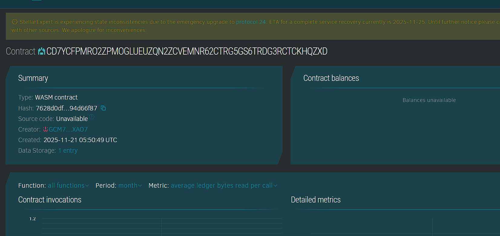

# ProofOfOrigin Store

## Project Title
ProofOfOrigin Store

## Project Description
ProofOfOrigin Store is a blockchain-based platform that guarantees the authenticity of specialty regional products such as wines, coffees, cheeses, and other artisanal goods. Using Soroban smart contracts on the Stellar blockchain, it creates immutable provenance records verified by authorized certifiers ensuring product authenticity and consumer trust.

## Project Vision
This platform aims to protect regional heritage and support fair trade by leveraging blockchain’s tamper-proof data storage to trace and verify product origins transparently. ProofOfOrigin Store strengthens authenticity claims, fosters consumer confidence, and combats counterfeit goods in specialty markets.

## Key Features
- Origin Record Registration: Producers register products with regional and harvest data.
- Quality Certification: Certified quality hashes stored to prove authenticity.
- Verification Process: Trusted authorities verify origin records on-chain.
- Immutable Provenance: All origin data stored permanently and transparently.
- Searchable Records: Publicly accessible product origin information.
- Producer Authentication: Only authorized producers can register origins.
- Prevents Counterfeiting: Blockchain immutability ensures product traceability.

## Usage Instructions
1. Producers register product origins with detailed metadata.
2. Certification bodies verify and approve origin records on blockchain.
3. Consumers and partners query origin data for validation.
4. Records are transparently audited and publicly accessible.

## Future Scope
- Integration with IoT sensors for real-time origin data.
- Multi-stage provenance tracking covering production and supply chain.
- QR code generation linking product packaging to blockchain records.
- Mobile apps for producers, certifiers, and consumers.
- Legal recognition and compliance with geographical indication laws.
- Cross-border verification for international trade support.

## Technology Stack
- Soroban Rust SDK for secure smart contracts.
- Stellar blockchain provides immutable decentralized ledger.
- Cryptographic validation for quality certification and data integrity.

## Contribution
Open for blockchain developers, specialty product experts, and certification bodies to enhance platform features and security. Contributions accepted via forks and pull requests.

## License
This project is licensed under the MIT License.

### Contract Detail
ID : CB3U4UB5Z75MG7VGAEHH6KQUOV76DX253OWYSEFVWDPI5VFYMEYRSKF5

